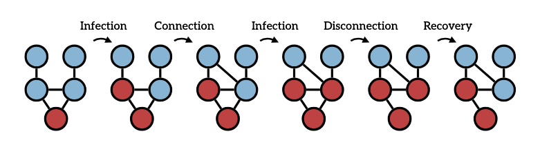

 

# 🎯 icon

Official Repo of the _icon: Fast Simulation of Epidemics on Coevolving Networks_ paper.

In _coevolving_ (or _adaptive_, a special case of _temporal_ or _time-varying_) networks, the network structure evolves in response to the spreading dynamics and vice versa.

_icon_ allows you to simulate epidemic models on coevolving networks using rejection sampling. 
We extend the classical stochastic and continuous-time SIS (Susceptible-Infected-Susceptible) model by incorporating rules that allow for the association (creating an edge) of two unconnected susceptible nodes and the dissociation (removing an edge) of connected infected nodes.
